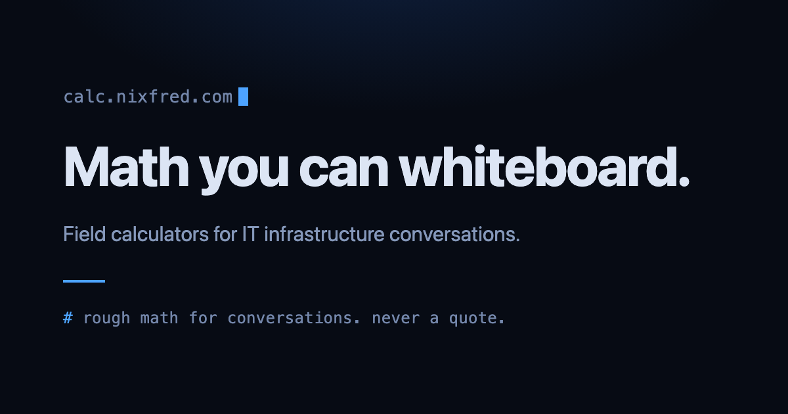
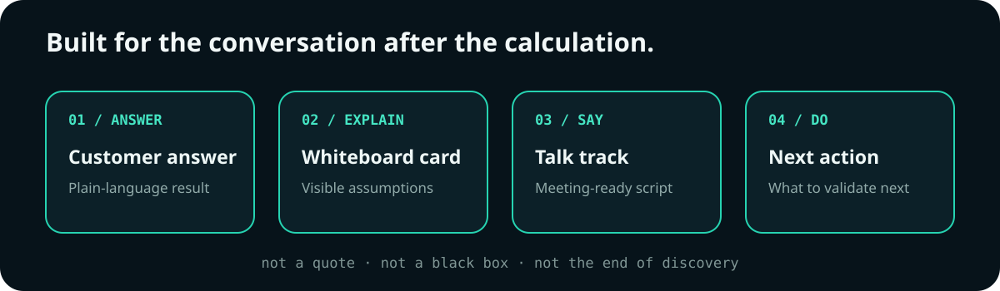
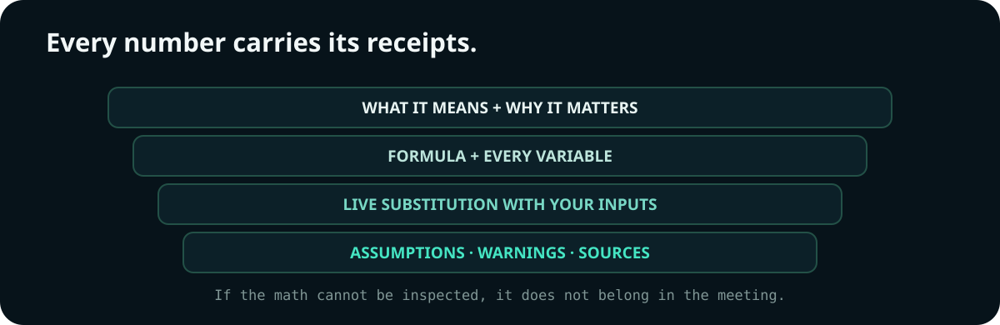
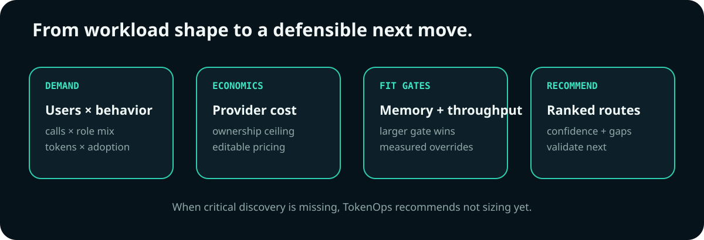
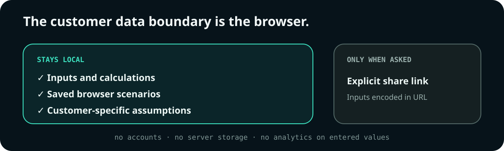

<div align="center">



# calc.nixfred.com

### Transparent field math for consequential infrastructure conversations.

[](https://astro.build)
[](#privacy-by-construction)
[](LICENSE)

**[Open the calculators →](https://calc.nixfred.com)**

</div>

Field calculators for IT infrastructure conversations. Live at
[calc.nixfred.com](https://calc.nixfred.com).

## What this is

Interactive decision tools built for live customer meetings, not hidden
spreadsheets. They turn rough sizing and workload questions into answers a
customer can inspect, discuss, and act on.



Live now: **[TokenOps](https://calc.nixfred.com/tokenops)**, an AI workload
placement and token economics calculator. Transparent math throughout: every
number shows its formula, variables, live substitution, assumptions, and
sources. Methodology in [docs/tokenops.md](docs/tokenops.md), completion audit
in [docs/tokenops-audit.md](docs/tokenops-audit.md), regression harness in
`tests/`.

Every calculator returns four things:

1. A customer friendly answer.
2. A whiteboard card.
3. A conversation script.
4. A next action.

## Live calculators

- **[TokenOps](https://calc.nixfred.com/tokenops)** models AI workload demand, token economics, GPU fit, ownership thresholds, and placement routes.
- **[Nutanix Conversation Sizer](https://calc.nixfred.com/nutanix-sizer)** turns discovery inputs into rough node ranges with CVM overhead included and explicit limits.

## The rules these tools follow



1. Rough math is never presented as a quote.
2. No vendor pricing is hardcoded. You enter your own assumptions.
3. Every assumption is visible on the result.
4. No logins. No saved data. Everything calculates in your browser.

## How TokenOps reaches a recommendation

TokenOps builds demand from users, adoption, call topology, role-specific token anatomy, retries, and context growth. It compares editable provider economics, computes a hardware budget ceiling, and treats memory fit and throughput fit as separate GPU gates. Route recommendations expose their weights, losing alternatives, confidence, and missing discovery.



If the top routes are too close or critical discovery is absent, the tool says so instead of manufacturing certainty. Full methodology: [docs/tokenops.md](docs/tokenops.md).

## Privacy by construction



There are no accounts or server-side scenario records. Entered values never go to analytics. Scenarios stay in browser storage; inputs enter a URL only when you explicitly create a share link, with a warning when a customer name would be included.

## Why open source

The formulas are the product. Anyone using a calculator in a meeting should
be able to open the source and check the math, and anyone who finds better
math is welcome to send a pull request. Each live calculator gets a
methodology document in `docs/` explaining its logic and its limits.

## Run it yourself

```bash
git clone https://github.com/nixfred/calc.nixfred.com.git
cd calc.nixfred.com
bun install
bun run dev
```

Static Astro site, no backend, no accounts, no tracking beyond a cookieless
Cloudflare Web Analytics beacon on the live site.

## License

MIT. See [LICENSE](LICENSE).

Built by [Fred Nix](https://nixfred.com).
